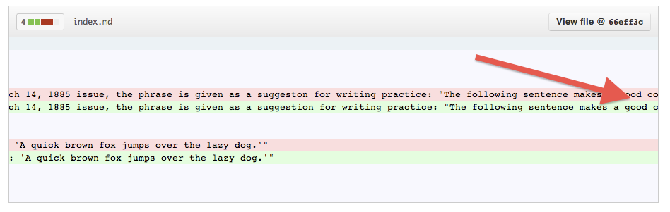
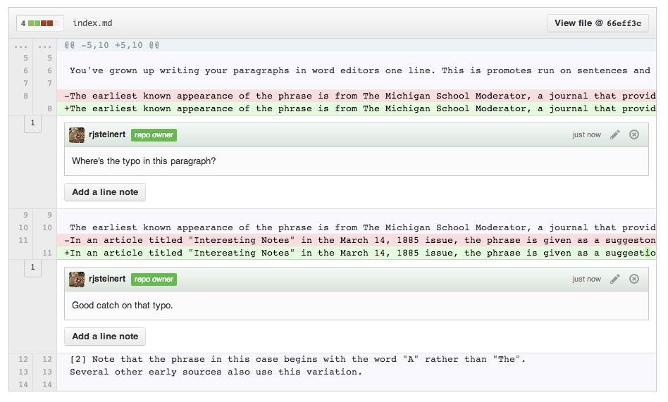

# For beautiful diffs, write your paragraphs like you write your poetry

You've grown up writing your paragraphs in word editors one line. This is promotes run on sentences and also makes your diffs very ugly to read. Take these two seemingly identical paragraphs.

The earliest known appearance of the phrase is from The Michigan School Moderator, a journal that provided teachers with education-related news and suggestions for lessons.[1] In an article titled "Interesting Notes" in the March 14, 1885 issue, the phrase is given as a suggestion for writing practice: "The following sentence makes a good copy for practice, as it contains every letter of the alphabet: 'A quick brown fox jumps over the lazy dog.'"[2] Note that the phrase in this case begins with the word "A" rather than "The". Several other early sources also use this variation.

The earliest known appearance of the phrase is from The Michigan School Moderator, a journal that provided teachers with education-related news and suggestions for lessons.[1]
In an article titled "Interesting Notes" in the March 14, 1885 issue, the phrase is given as a suggestion for writing practice: "The following sentence makes a good copy for practice, as it contains every letter of the alphabet: 'A quick brown fox jumps over the lazy dog.'"
[2] Note that the phrase in this case begins with the word "A" rather than "The". 
Several other early sources also use this variation.

The difference you'll see if you check the raw source file is that first paragraph is a run on paragraph with only spaces between the sentences while the second paragraph has a line break between sentences yet it still shows up as a solid paragraph when rendered.  Note, make sure not to put spaces after your periods, that will actually cause the line to break!

This is useful especially when comparing revisions, otherwise known as looking at the diff (differnce) between the saves.  Here's are some examples of fixing the same typo in each of these paragraphs.  See how much better the parapgraph with line breaks looks?

I can spot the change in the second paragraph on the first paragraph without having to scroll left or right.

The first paragraph scrolls to the right so far!

Diff comments are line specific so with a paragraph that has each sentence on a line, we can targe specific sentences with out comments.

# Interesting tools for writing/viewing the writings in a git repository

http://gist.io/
http://bl.ocks.org/
http://prose.io/
